# Filo-Priori V9 Pipeline Architecture

This document provides visual diagrams of the complete Filo-Priori pipeline.

## Quick Overview

```mermaid
flowchart LR
    subgraph Input
        A[("📁 Data")]
    end

    subgraph Processing
        B["🔤 Semantic<br/>SBERT + FFN"]
        C["📊 Structural<br/>Features + GAT"]
    end

    subgraph Fusion
        D["🔗 Cross-Attention"]
    end

    subgraph Output
        E["🎯 P(Fail)"]
        F["📋 Ranked Tests"]
    end

    A --> B
    A --> C
    B --> D
    C --> D
    D --> E
    E --> F

    style A fill:#c6f6d5,stroke:#276749
    style B fill:#bee3f8,stroke:#2b6cb0
    style C fill:#feebc8,stroke:#c05621
    style D fill:#fed7e2,stroke:#b83280
    style E fill:#e9d8fd,stroke:#6b46c1
    style F fill:#b2f5ea,stroke:#285e61
```

---

## Detailed Pipeline

```mermaid
flowchart TB
    classDef data fill:#c6f6d5,stroke:#276749,stroke-width:2px,color:#22543d
    classDef semantic fill:#bee3f8,stroke:#2b6cb0,stroke-width:2px,color:#2c5282
    classDef structural fill:#feebc8,stroke:#c05621,stroke-width:2px,color:#744210
    classDef fusion fill:#fed7e2,stroke:#b83280,stroke-width:2px,color:#702459
    classDef training fill:#e9d8fd,stroke:#6b46c1,stroke-width:2px,color:#44337a
    classDef eval fill:#fefcbf,stroke:#b7791f,stroke-width:2px,color:#744210
    classDef output fill:#b2f5ea,stroke:#285e61,stroke-width:2px,color:#234e52

    subgraph DATA["📁 DATA INPUT"]
        D1[("train.csv")]
        D2[("test.csv")]
        D3["DataLoader<br/>Build-level splits"]
    end

    subgraph SEMANTIC["🔤 SEMANTIC STREAM"]
        S1["Text Input<br/>TC_Summary + Steps + Commits"]
        S2["SBERT Encoder<br/>all-mpnet-base-v2"]
        S3["1536-dim Embedding"]
        S4["FFN: 1536→256"]
        S5(["256-dim"])
    end

    subgraph STRUCTURAL["📊 STRUCTURAL STREAM"]
        T1["19 Features<br/>10 base + 9 DeepOrder"]
        T2["Multi-Edge Graph<br/>~32K edges"]
        T3["GAT: 19→256<br/>2 heads"]
        T4(["256-dim"])
    end

    subgraph FUSION["🔗 FUSION"]
        F1["Cross-Attention<br/>Bidirectional"]
        F2["512-dim"]
        F3["Classifier<br/>512→128→64→2"]
        F4(["P(Fail)"])
    end

    subgraph TRAIN["⚡ TRAINING"]
        TR1["Balanced Sampling 10:1"]
        TR2["Focal Loss α=0.5 γ=2.0"]
        TR3["AdamW lr=3e-5"]
    end

    subgraph POST["🔧 POST-PROCESSING"]
        P1["Threshold: 0.2777"]
        P2["Orphan KNN k=20"]
        P3["Hybrid Ranking"]
    end

    subgraph EVAL["📈 RESULTS"]
        E1["APFD: 0.7595"]
        E2["67.9% builds ≥0.7"]
    end

    D1 --> D3
    D2 --> D3
    D3 --> S1
    D3 --> T1

    S1 --> S2 --> S3 --> S4 --> S5
    T1 --> T2 --> T3 --> T4
    S3 -.-> T2

    S5 --> F1
    T4 --> F1
    F1 --> F2 --> F3 --> F4

    F4 --> TR1 --> TR2 --> TR3
    F4 --> P1
    F4 --> P2
    P1 --> P3
    P2 --> P3
    P3 --> E1 --> E2

    class D1,D2,D3 data
    class S1,S2,S3,S4,S5 semantic
    class T1,T2,T3,T4 structural
    class F1,F2,F3,F4 fusion
    class TR1,TR2,TR3 training
    class P1,P2,P3,E1,E2 eval
```

---

## Component Details

### Data Flow

### Semantic Stream Details

```mermaid
flowchart TB
    subgraph Input["Text Inputs"]
        A["TC_Summary<br/>'Verify login functionality'"]
        B["TC_Steps<br/>'1. Navigate to...<br/>2. Enter credentials...'"]
        C["Commit Messages<br/>'Fix auth bug'"]
    end

    subgraph SBERT["SBERT Processing"]
        D["Tokenization"]
        E["Transformer Encoding"]
        F["Mean Pooling"]
    end

    subgraph Embeddings["Embeddings"]
        G["TC Embedding<br/>768-dim"]
        H["Commit Embedding<br/>768-dim"]
        I["Concatenated<br/>1536-dim"]
    end

    subgraph FFN["Feed-Forward Network"]
        J["Linear 1536→256<br/>+ LayerNorm + GELU"]
        K["Linear 256→256<br/>+ LayerNorm + GELU"]
        L["Residual Connection"]
    end

    M(["Semantic Features<br/>256-dim"])

    A & B --> D
    C --> D
    D --> E --> F
    F --> G & H
    G & H --> I
    I --> J --> K --> L --> M

    style Input fill:#e8f5e9
    style SBERT fill:#e3f2fd
    style Embeddings fill:#fff3e0
    style FFN fill:#fce4ec
```

### Multi-Edge Graph

```mermaid
flowchart TB
    subgraph Nodes["Test Nodes (2,347)"]
        N1["Test A"]
        N2["Test B"]
        N3["Test C"]
        N4["Test D"]
    end

    subgraph Edges["Edge Types"]
        E1["🔴 Co-Failure<br/>weight: 1.0<br/>Failed together"]
        E2["🟢 Co-Success<br/>weight: 0.5<br/>Passed together"]
        E3["🔵 Semantic<br/>weight: 0.3<br/>Similar text"]
        E4["🟡 Temporal<br/>Recent patterns"]
        E5["🟣 Component<br/>Same module"]
    end

    N1 <-->|co-fail| N2
    N1 <-.->|semantic| N3
    N2 <-->|co-pass| N4
    N3 <-->|temporal| N4

    style E1 fill:#ffcdd2
    style E2 fill:#c8e6c9
    style E3 fill:#bbdefb
    style E4 fill:#fff9c4
    style E5 fill:#e1bee7
```

### GAT Attention Mechanism

```mermaid
flowchart LR
    subgraph Input["Input"]
        A["Node Features<br/>19-dim"]
        B["Adjacency<br/>Matrix"]
    end

    subgraph Attention["Attention Computation"]
        C["W · h_i<br/>Linear transform"]
        D["W · h_j<br/>Neighbor transform"]
        E["Concat [Wh_i || Wh_j]"]
        F["LeakyReLU(a · E)"]
        G["Softmax<br/>α_ij"]
    end

    subgraph Aggregation["Message Passing"]
        H["Σ α_ij · W · h_j"]
        I["ELU Activation"]
        J["Multi-head concat"]
    end

    K(["Structural Features<br/>256-dim"])

    A --> C --> E
    B --> D --> E
    E --> F --> G --> H --> I --> J --> K

    style Input fill:#fff3e0
    style Attention fill:#e3f2fd
    style Aggregation fill:#f3e5f5
```

### Cross-Attention Fusion

---

## Results Summary

| Metric | Value |
|--------|-------|
| **Mean APFD** | **0.7595** |
| **Median APFD** | **0.7944** |
| APFD ≥ 0.7 | 67.9% (188/277) |
| APFD ≥ 0.5 | 89.2% (247/277) |
| APFD = 1.0 | 8.3% (23/277) |
| Val F1 Macro | 0.5899 |
| Test F1 Macro | 0.5870 |

---

## Files

- **Full diagram**: `docs/pipeline_diagram.mmd`
- **Overview diagram**: `docs/pipeline_overview.mmd`
- **Config**: `configs/experiment_industry_optimized_v3.yaml`
- **Results**: `results/experiment_industry_optimized_v3/`

---

*Generated: December 2025*
