# Filo-Priori V8: Dual-Stream Architecture Specifications

## 🏗️ Model Architecture Flow

```mermaid
flowchart LR
    A["📥 Semantic<br/>SBERT [1536]"] --> B["🔤 MLP Semântico<br/>1536→256"]
    C["📥 Structural<br/>Features [10]"] --> D["🕸️ MLP Estrutural<br/>10→64"]
    E["📥 Graph<br/>Multi-Edge"] --> F["⚡ GAT<br/>64→128→64"]
    D --> F

    B --> G["🔗 Fusion MLP<br/>320→256"]
    F --> G

    G --> H["🎯 Classifier<br/>256→128→2"]
    H --> I["📊 Predictions<br/>Pass/Fail"]

    style A fill:#E3F2FD,stroke:#1976D2,stroke-width:2px
    style B fill:#E8F5E9,stroke:#388E3C,stroke-width:2px
    style C fill:#FFF3E0,stroke:#F57C00,stroke-width:2px
    style D fill:#FFF3E0,stroke:#F57C00,stroke-width:2px
    style E fill:#FFF3E0,stroke:#F57C00,stroke-width:2px
    style F fill:#FFF3E0,stroke:#F57C00,stroke-width:2px
    style G fill:#F3E5F5,stroke:#7B1FA2,stroke-width:2px
    style H fill:#FCE4EC,stroke:#C2185B,stroke-width:2px
    style I fill:#E0F2F1,stroke:#00796B,stroke-width:2px
```

---

## 📊 Component Specifications

| Component | Input Dim | Hidden Dim | Output Dim | Layers | Activation | Parameters |
|-----------|-----------|------------|------------|--------|------------|------------|
| **MLP Semântico** | 1536 | 256 | 256 | 2 | GELU | ~1.0M (79.4%) |
| **MLP Estrutural** | 10 | 64 | 64 | 2 | GELU | ~5K (0.4%) |
| **GAT Layer** | 64 | 128 (2 heads) | 64 | 1 | ELU | ~26K (2.1%) |
| **Fusion MLP** | 320 | 256 | 256 | 2 | GELU | ~166K (13.2%) |
| **Classificador** | 256 | 128 | 2 | - | Softmax | ~66K (5.2%) |
| **TOTAL** | - | - | - | - | - | **~1.26M** |

---

## 🎯 Model Performance

| Metric | Value | Description |
|--------|-------|-------------|
| **Mean APFD** | **0.6171** | Average Percentage of Faults Detected |
| **F1-Macro** | 0.5312 | Balanced classification performance |
| **Accuracy** | 63.29% | Overall classification accuracy |
| **Improvement** | +23.4% | vs Random test ordering |

---

## 🔑 Key Design Principles

### 1. **Separation of Concerns**
- **Semantic Stream**: Processes "what the test does" (text embeddings)
- **Structural Stream**: Processes "how it behaves" (execution history)

### 2. **Multi-Edge Phylogenetic Graph**
- **Co-failure edges** (weight=1.0): Tests failing together
- **Co-success edges** (weight=0.5): Tests passing together
- **Semantic edges** (weight=0.3): Content similarity

### 3. **Graph Attention Networks (GAT)**
- 2-head attention mechanism
- Learns which test relationships matter most
- Orphan handling for new test cases

---

## 📈 Parameter Distribution

---

**Version**: V8 (Production)
**Experiment**: 06 - Feature Selection
**Dataset**: 52,102 test executions, 1,339 builds, 2,347 unique test cases
