# STEP 2.1: Data Flow and Technical Architecture

## Complete Data Flow: From Raw Data to Model Input

```mermaid
flowchart TB
    subgraph raw["📁 Raw Data Sources"]
        direction LR
        train_csv["datasets/train.csv<br/>(~69K records)"]
        test_csv["datasets/test.csv<br/>(~31K records)"]
    end

    subgraph columns["Required Columns"]
        direction TB
        tc_key["TC_Key<br/>(Test Case ID)"]
        build["Build_ID<br/>(Build Identifier)"]
        result["TE_Test_Result<br/>(Pass/Fail/Delete/Blocked)"]
        date["Build_Test_Start_Date<br/>(Chronology)"]
        commits["commit<br/>(Commit messages)"]
        text["TE_Summary, TC_Steps<br/>(Text descriptions)"]
    end

    subgraph processing["🔄 Processing Pipeline"]
        direction TB

        step1["1️⃣ Load & Split<br/>DataLoader.prepare_dataset()"]
        step2["2️⃣ Extract Features<br/>Parallel Processing"]

        subgraph parallel["Parallel Feature Extraction"]
            direction LR

            subgraph semantic_pipeline["Semantic Pipeline"]
                direction TB
                txt_proc["TextProcessor<br/>prepare_batch_texts()"]
                combine["Combine 3 fields:<br/>Summary + Steps + Commits"]
                encode["SemanticEncoder<br/>encode_dataset()"]
                sem_cache["Cache:<br/>embeddings/*.npy"]
                sem_output["Output:<br/>[N, 1024]"]

                txt_proc --> combine --> encode --> sem_cache --> sem_output
            end

            subgraph structural_pipeline["Structural Pipeline"]
                direction TB
                init["StructuralFeatureExtractor<br/>__init__(recent_window=5)"]
                fit["fit(df_train)<br/>Learn Patterns"]
                history["Build History:<br/>• Chronology<br/>• TC statistics<br/>• First appearances"]
                transform["transform(df)<br/>Extract Features"]
                struct_cache["Cache:<br/>structural_features.pkl"]
                struct_output["Output:<br/>[N, 6]"]

                init --> fit --> history --> transform --> struct_cache --> struct_output
            end
        end

        step1 --> step2
        step2 --> parallel
    end

    subgraph features_detail["📊 Feature Matrix Structure"]
        direction TB

        matrix["Feature Matrix Shape: [N, 6]"]

        subgraph feature_cols["Feature Columns (in order)"]
            direction LR
            col0["[0] test_age<br/>float32"]
            col1["[1] failure_rate<br/>float32"]
            col2["[2] recent_failure_rate<br/>float32"]
            col3["[3] flakiness_rate<br/>float32"]
            col4["[4] commit_count<br/>float32"]
            col5["[5] test_novelty<br/>float32"]
        end

        matrix --> feature_cols
    end

    subgraph model_input["🎯 Model Input Format"]
        direction TB

        batch["Batch Size: 32"]

        input_sem["Semantic Input:<br/>Tensor[32, 1024]<br/>dtype: float32<br/>device: cuda/cpu"]

        input_struct["Structural Input:<br/>Tensor[32, 6]<br/>dtype: float32<br/>device: cuda/cpu"]

        labels["Labels:<br/>Tensor[32]<br/>dtype: long<br/>values: {0, 1}"]
    end

    raw --> columns
    columns --> processing
    parallel --> features_detail
    features_detail --> model_input

    style semantic_pipeline fill:#e1f5ff,stroke:#0077cc,stroke-width:2px
    style structural_pipeline fill:#fff4e1,stroke:#cc7700,stroke-width:2px
    style model_input fill:#d4edda,stroke:#28a745,stroke-width:2px
```

## Historical Feature Computation: Step-by-Step

```mermaid
sequenceDiagram
    participant DF as DataFrame
    participant Ext as StructuralFeatureExtractor
    participant Hist as History Cache
    participant Out as Feature Matrix

    Note over DF,Out: TRAINING PHASE

    DF->>Ext: fit(df_train)
    activate Ext

    Ext->>Ext: _establish_chronology()
    Note right of Ext: Sort builds by date<br/>Create build_idx mapping

    Ext->>Ext: _compute_tc_history()
    Note right of Ext: For each TC_Key:<br/>• Count executions<br/>• Count failures<br/>• Track results

    Ext->>Ext: _compute_first_appearances()
    Note right of Ext: Store first build_idx<br/>for each TC_Key

    Ext->>Hist: save_history(cache_path)
    Note right of Hist: Pickle dump:<br/>• tc_history<br/>• build_chronology<br/>• tc_first_appearance

    deactivate Ext

    Note over DF,Out: TRANSFORMATION PHASE

    DF->>Ext: transform(df_train, is_test=False)
    activate Ext

    Hist->>Ext: load_history(cache_path)
    Note right of Hist: Load cached<br/>historical stats

    loop For each row in df
        Ext->>Ext: _extract_phylogenetic_features()
        Note right of Ext: Lookup TC_Key in history<br/>Compute 4 features

        Ext->>Ext: _extract_structural_features()
        Note right of Ext: Parse commits<br/>Check novelty<br/>Compute 2 features

        Ext->>Ext: Concatenate [phylo + struct]
    end

    Ext->>Out: Return np.ndarray [N, 6]
    Note right of Out: dtype: float32<br/>All values normalized

    deactivate Ext

    Note over DF,Out: TEST/VALIDATION PHASE

    DF->>Ext: transform(df_test, is_test=True)
    activate Ext

    Note right of Ext: is_test=True:<br/>• Use ONLY train history<br/>• Unknown TC → defaults

    Hist->>Ext: load_history(cache_path)

    loop For each test sample
        Ext->>Ext: Lookup TC_Key
        alt TC_Key known from training
            Ext->>Ext: Use historical stats
        else TC_Key unseen
            Ext->>Ext: Use defaults:<br/>age=0, rates=0.0
        end
    end

    Ext->>Out: Return np.ndarray [N_test, 6]

    deactivate Ext
```



## Feature Value Distributions (Validated on 20K samples)

```mermaid
graph TB
    subgraph test_age["Feature 1: test_age"]
        age_dist["Distribution:<br/>Min: 0<br/>Mean: 855<br/>Max: 2717<br/>Median: 645"]
        age_meaning["Meaning:<br/>Number of builds since<br/>first appearance<br/>Higher = older test"]
    end

    subgraph failure_rate["Feature 2: failure_rate"]
        fr_dist["Distribution:<br/>Min: 0.0<br/>Mean: 0.12<br/>Max: 1.0<br/>Median: 0.0"]
        fr_meaning["Meaning:<br/>Historical failure rate<br/>Higher = more failures<br/>Aligns with 12% class imbalance"]
    end

    subgraph recent_failure_rate["Feature 3: recent_failure_rate"]
        rfr_dist["Distribution:<br/>Min: 0.0<br/>Mean: 0.13<br/>Max: 1.0<br/>Window: 5 builds"]
        rfr_meaning["Meaning:<br/>Recent failure trend<br/>Higher = failing recently<br/>More volatile than overall rate"]
    end

    subgraph flakiness_rate["Feature 4: flakiness_rate"]
        flake_dist["Distribution:<br/>Min: 0.0<br/>Mean: 0.13<br/>Max: 1.0<br/>Median: 0.10"]
        flake_meaning["Meaning:<br/>Pass↔Fail transitions<br/>Higher = unstable test<br/>13% have some flakiness"]
    end

    subgraph commit_count["Feature 5: commit_count"]
        cc_dist["Distribution:<br/>Min: 2<br/>Mean: 3.2<br/>Max: 12305<br/>Median: 3"]
        cc_meaning["Meaning:<br/>Number of unique commits<br/>Higher = more code changes<br/>Most tests: 3 commits"]
    end

    subgraph test_novelty["Feature 6: test_novelty"]
        nov_dist["Distribution:<br/>Values: {0.0, 1.0}<br/>Mean: 0.13<br/>Binary flag"]
        nov_meaning["Meaning:<br/>First appearance flag<br/>1.0 = new test<br/>13% are novel"]
    end

    style test_age fill:#e3f2fd
    style failure_rate fill:#f3e5f5
    style recent_failure_rate fill:#e8f5e9
    style flakiness_rate fill:#fff3e0
    style commit_count fill:#fce4ec
    style test_novelty fill:#e0f2f1
```



## Cache Strategy and Performance

```mermaid
flowchart LR
    subgraph first_run["🏃 First Run (No Cache)"]
        direction TB
        load1["Load train.csv<br/>69K samples"]
        compute1["Compute Features<br/>⏱️ ~30 seconds"]
        save1["Save Cache<br/>structural_features.pkl<br/>~2MB"]

        load1 --> compute1 --> save1
    end

    subgraph cached_run["⚡ Cached Run"]
        direction TB
        load2["Load Cache<br/>structural_features.pkl"]
        instant["Instant Load<br/>⏱️ <1 second"]
        transform2["Transform Only<br/>⏱️ ~5 seconds"]

        load2 --> instant --> transform2
    end

    subgraph cache_contents["📦 Cache Contents"]
        direction TB
        tc_hist["tc_history<br/>{TC_Key: stats}"]
        chronology["build_chronology<br/>[Build_IDs ordered]"]
        appearances["tc_first_appearance<br/>{TC_Key: build_idx}"]
        metadata["Metadata<br/>• recent_window<br/>• num_builds<br/>• num_tests"]
    end

    first_run -->|"Subsequent runs"| cached_run
    save1 -.->|"Contains"| cache_contents

    style first_run fill:#fff3cd,stroke:#856404,stroke-width:2px
    style cached_run fill:#d4edda,stroke:#155724,stroke-width:2px
```



## Data Leakage Prevention

```mermaid
flowchart TB
    subgraph correct["✅ CORRECT: No Leakage"]
        direction TB
        train_data["Training Data<br/>(69K samples)"]
        fit_phase["fit() Phase<br/>Learn ALL patterns"]
        train_hist["Training History<br/>LOCKED"]

        test_data["Test Data<br/>(31K samples)"]
        transform_test["transform(is_test=True)<br/>Use ONLY train history"]

        train_data --> fit_phase --> train_hist
        test_data --> transform_test
        train_hist -.->|"Read only"| transform_test

        note1["✓ Test samples use<br/>training statistics only"]
        note2["✓ Unknown TC_Keys<br/>get default values"]
        note3["✓ No future information"]
    end

    subgraph wrong["❌ WRONG: Data Leakage"]
        direction TB
        all_data["ALL Data<br/>(Train + Test)"]
        bad_fit["fit(all_data)<br/>⚠️ Uses test info!"]
        bad_hist["History includes<br/>FUTURE results"]

        all_data --> bad_fit --> bad_hist

        warn1["✗ Test results<br/>leak into training"]
        warn2["✗ Inflated metrics"]
        warn3["✗ Invalid research"]
    end

    style correct fill:#d4edda,stroke:#155724,stroke-width:3px
    style wrong fill:#f8d7da,stroke:#721c24,stroke-width:3px
    style note1 fill:#d1ecf1,stroke:#0c5460
    style note2 fill:#d1ecf1,stroke:#0c5460
    style note3 fill:#d1ecf1,stroke:#0c5460
    style warn1 fill:#f8d7da,stroke:#721c24
    style warn2 fill:#f8d7da,stroke:#721c24
    style warn3 fill:#f8d7da,stroke:#721c24
```



## Integration Example Code

```python
# 1. Import
from src.preprocessing.structural_feature_extractor import extract_structural_features

# 2. Extract features (with caching)
train_features, val_features, test_features = extract_structural_features(
    df_train,          # Training DataFrame
    df_val,            # Validation DataFrame
    df_test,           # Test DataFrame
    recent_window=5,   # Window for recent_failure_rate
    cache_path='cache/structural_features.pkl'  # Cache location
)

# 3. Verify shapes
assert train_features.shape == (len(df_train), 6)  # [N, 6]
assert val_features.shape == (len(df_val), 6)
assert test_features.shape == (len(df_test), 6)

# 4. Convert to tensors
import torch
train_struct_tensor = torch.FloatTensor(train_features)  # [N, 6]
val_struct_tensor = torch.FloatTensor(val_features)
test_struct_tensor = torch.FloatTensor(test_features)

# 5. Create DataLoader
from torch.utils.data import TensorDataset, DataLoader

train_dataset = TensorDataset(
    semantic_embeddings,    # [N, 1024] from BGE
    train_struct_tensor,    # [N, 6] from StructuralFeatureExtractor
    labels                  # [N]
)

train_loader = DataLoader(train_dataset, batch_size=32, shuffle=True)

# 6. Training loop
for semantic_batch, structural_batch, labels_batch in train_loader:
    # semantic_batch: [32, 1024]
    # structural_batch: [32, 6]
    # labels_batch: [32]

    logits = model(
        semantic_input=semantic_batch,
        structural_input=structural_batch
    )
    # Continue with loss computation and backprop...
```

---

## Summary: Before and After STEP 2.1

| Aspect | V7 (Before) | V8 (After STEP 2.1) |
|--------|-------------|---------------------|
| **Semantic Stream** | BGE embeddings [1024] | BGE embeddings [1024] ✓ |
| **Structural Stream** | ❌ BGE embeddings [1024] | ✅ Historical features [6] |
| **Information Sources** | ❌ Same (semantic only) | ✅ Orthogonal (semantic + structural) |
| **Feature Extraction** | ❌ Single encoder | ✅ Dual extraction pipeline |
| **Data Leakage** | ⚠️ Potential risk | ✅ Properly prevented |
| **Validation** | ❌ No validation | ✅ Comprehensive (20K samples) |
| **Thesis Hypothesis** | ❌ Cannot validate | ✅ Can properly validate |
| **Performance** | - | ✅ 30s for 69K samples |
| **Documentation** | - | ✅ 2,321 lines of docs |

**Impact**: Breaking the Semantic Echo Chamber enables true validation of the dual-stream hypothesis.
