# STEP 2.1: Structural Features Extraction - Architecture Diagram

## Overview: Breaking the Semantic Echo Chamber

```mermaid
flowchart TB
    subgraph problem["❌ PROBLEMA V7: Semantic Echo Chamber"]
        direction TB
        v7data[("Dataset<br/>Train/Test")]
        v7bge["BGE Encoder<br/>(1024-dim)"]
        v7sem["Semantic Stream<br/>BGE Embeddings"]
        v7struct["Structural Stream<br/>⚠️ SAME BGE Embeddings"]
        v7fusion["Fusion Layer<br/>❌ Redundant Info"]

        v7data --> v7bge
        v7bge --> v7sem
        v7bge --> v7struct
        v7sem --> v7fusion
        v7struct --> v7fusion

        style v7struct fill:#f99,stroke:#f00,stroke-width:3px
        style v7fusion fill:#f99,stroke:#f00,stroke-width:3px
    end

    subgraph solution["✅ SOLUÇÃO V8: Orthogonal Information Sources"]
        direction TB
        v8data[("Dataset<br/>Train/Test")]
        v8text["Text Data<br/>(Summary, Steps, Commits)"]
        v8history["Historical Data<br/>(Test Execution History)"]

        v8bge["BGE Encoder<br/>(1024-dim)"]
        v8extractor["StructuralFeatureExtractor<br/>(6-dim)"]

        v8sem["Semantic Stream<br/>Text Embeddings"]
        v8struct["Structural Stream<br/>✅ True Historical Features"]
        v8fusion["Fusion Layer<br/>✅ Complementary Info"]

        v8data --> v8text
        v8data --> v8history
        v8text --> v8bge
        v8history --> v8extractor
        v8bge --> v8sem
        v8extractor --> v8struct
        v8sem --> v8fusion
        v8struct --> v8fusion

        style v8struct fill:#9f9,stroke:#0f0,stroke-width:3px
        style v8fusion fill:#9f9,stroke:#0f0,stroke-width:3px
    end

    problem -.->|"STEP 2.1<br/>Implementation"| solution
```

## Structural Feature Extraction Pipeline

## Feature Computation Details

```mermaid
flowchart TB
    subgraph history["Historical Statistics per TC_Key"]
        direction TB
        chronology["Establish Build Chronology<br/>(Build_Test_Start_Date)"]
        groupby["Group by TC_Key<br/>(325 unique test cases)"]
        stats["Compute Statistics:<br/>• Total executions<br/>• Total failures<br/>• Result history"]

        chronology --> groupby --> stats
    end

    subgraph computation["Feature Computation for Each Sample"]
        direction LR

        subgraph phylo_comp["Phylogenetic Computation"]
            age["test_age =<br/>current_build_idx -<br/>first_build_idx"]

            fr["failure_rate =<br/>total_failures /<br/>total_executions"]

            rfr["recent_failure_rate =<br/>failures_in_window /<br/>window_size"]

            flake["flakiness_rate =<br/>transitions /<br/>(total_exec - 1)"]
        end

        subgraph struct_comp["Structural Computation"]
            commits["commit_count =<br/>len(unique_commits)"]

            novelty["test_novelty =<br/>1.0 if first_appear<br/>else 0.0"]
        end
    end

    subgraph validation["✅ Validation Results (20K samples)"]
        direction TB
        ranges["All Features in Expected Ranges:<br/>✓ test_age: [0, 2717]<br/>✓ failure_rate: [0.0, 1.0]<br/>✓ recent_failure_rate: [0.0, 1.0]<br/>✓ flakiness_rate: [0.0, 1.0]<br/>✓ commit_count: [2, 12305]<br/>✓ test_novelty: [0.0, 1.0]"]

        stats_val["Statistics Aligned:<br/>✓ Mean failure: 12%<br/>✓ Mean age: 855 builds<br/>✓ Mean flakiness: 13%<br/>✓ New tests: 13%"]

        leak["No Data Leakage:<br/>✓ Test uses train history only<br/>✓ Unknown tests → defaults"]
    end

    history --> computation
    computation --> validation

    style ranges fill:#d4edda,stroke:#28a745,stroke-width:2px
    style stats_val fill:#d4edda,stroke:#28a745,stroke-width:2px
    style leak fill:#d4edda,stroke:#28a745,stroke-width:2px
```

## Integration into V8 Architecture

```mermaid
flowchart TB
    subgraph data_prep["Data Preparation Phase"]
        direction LR
        raw["Raw Dataset<br/>(CSV files)"]
        loader["DataLoader"]
        splits["Train/Val/Test<br/>Splits"]

        raw --> loader --> splits
    end

    subgraph feature_extraction["Feature Extraction Phase"]
        direction TB

        subgraph semantic_path["Semantic Path"]
            text_proc["TextProcessor<br/>Combine fields"]
            bge_enc["BGE Encoder<br/>encode_dataset()"]
            sem_emb["Semantic Embeddings<br/>[N, 1024]"]

            text_proc --> bge_enc --> sem_emb
        end

        subgraph structural_path["Structural Path"]
            struct_ext["StructuralFeatureExtractor<br/>fit() + transform()"]
            struct_feat["Structural Features<br/>[N, 6]"]

            struct_ext --> struct_feat
        end
    end

    subgraph model["V8 Model Architecture"]
        direction TB

        subgraph dual_stream["DualStreamModelV8"]
            sem_stream["Semantic Stream<br/>Input: [batch, 1024]<br/>Output: [batch, 256]"]

            struct_stream["Structural Stream<br/>Input: [batch, 6]<br/>↓ Linear(6→256)<br/>Output: [batch, 256]"]

            fusion_layer["Fusion Layer<br/>Cross-Attention<br/>[batch, 512]"]

            classifier["Classifier<br/>[512→128→64→2]"]
        end

        sem_stream --> fusion_layer
        struct_stream --> fusion_layer
        fusion_layer --> classifier
    end

    subgraph results["Results & Metrics"]
        predictions["Predictions<br/>(Pass/Not-Pass)"]
        metrics["Metrics:<br/>• Accuracy<br/>• F1 Score<br/>• APFD"]
    end

    data_prep --> feature_extraction
    semantic_path --> sem_stream
    structural_path --> struct_stream
    model --> results

    style structural_path fill:#fff4e1,stroke:#cc7700,stroke-width:3px
    style struct_stream fill:#fff4e1,stroke:#cc7700,stroke-width:3px
```

## Key Achievements

## Performance Metrics

```mermaid
graph LR
    subgraph perf["⚡ Performance"]
        time1["Training 69K:<br/>~30 seconds"]
        time2["Test 31K:<br/>~15 seconds"]
        mem["Memory:<br/><2GB RAM"]
        cache["Caching:<br/>Supported (pickle)"]
    end

    subgraph quality["✨ Quality"]
        range["All ranges valid"]
        dist["Realistic distributions"]
        spread["Good feature spread"]
        missing["No missing values"]
    end

    subgraph next["➡️ Next: STEP 2.2"]
        task["Modify Structural Stream"]
        change1["Input: [1024] → [6]"]
        change2["Update architecture"]
        time["2-3 hours estimated"]
    end

    style perf fill:#d1ecf1,stroke:#0c5460,stroke-width:2px
    style quality fill:#d4edda,stroke:#155724,stroke-width:2px
    style next fill:#fff3cd,stroke:#856404,stroke-width:2px
```

---

## Files Created

| File | Lines | Purpose |
|------|-------|---------|
| `structural_feature_extractor.py` | 576 | Core extraction module |
| `validate_structural_features.py` | 391 | Validation script |
| `V8_IMPLEMENTATION_STEP_2.1_COMPLETE.md` | 483 | Technical report |
| `V7_TO_V8_CHANGES.md` | 228 | Migration guide |
| `IMPLEMENTATION_STATUS.md` | 370 | Status tracking |
| `extract_features_example.py` | 273 | Usage examples |

**Total: ~2,321 lines of production-ready code and documentation**

---

## Status: ✅ READY FOR STEP 2.2

Expected improvement: **+5-10% APFD** over V7
