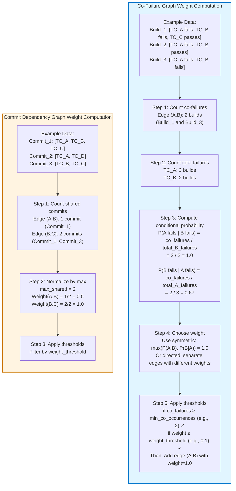
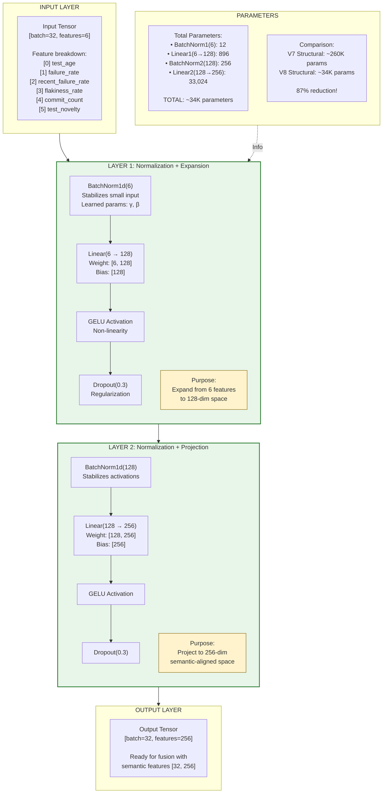
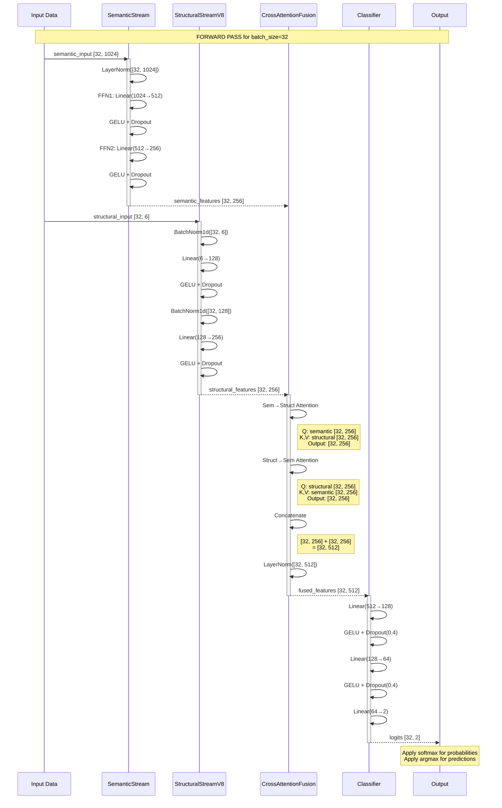
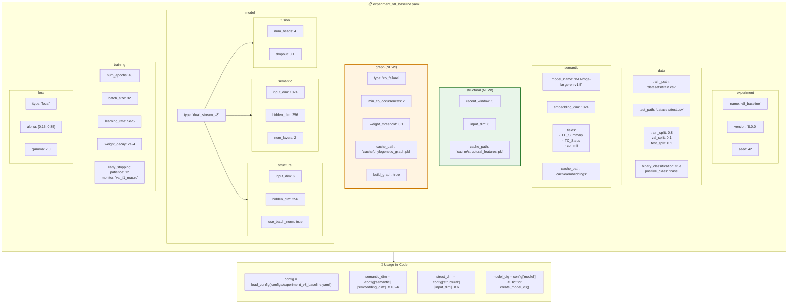
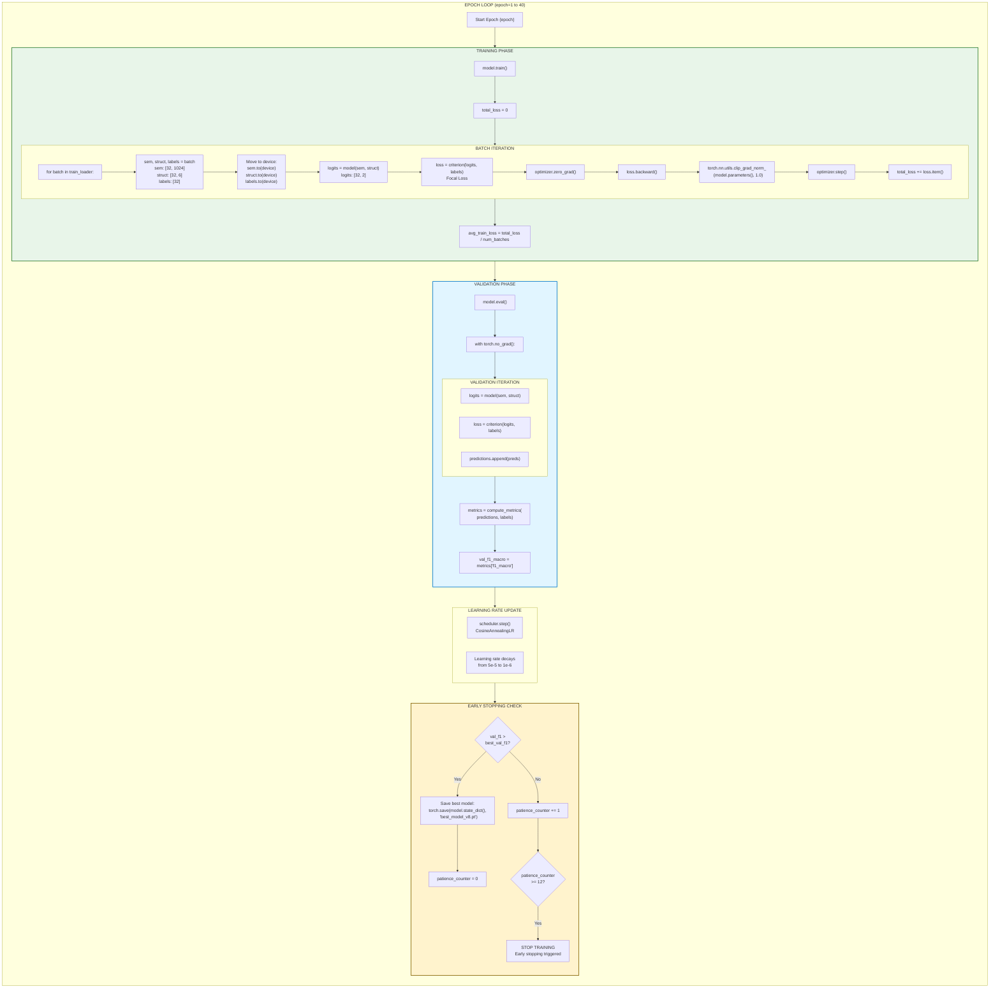
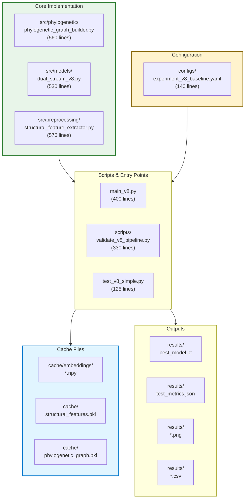

# STEP 2.2: Implementation Details & Technical Flow

## Complete Data Flow: From Raw Data to Predictions

```mermaid
flowchart TB
    subgraph raw_data["📁 RAW DATA"]
        train_csv["train.csv<br/>~69K records"]
        test_csv["test.csv<br/>~31K records"]

        columns["Required Columns:<br/>• Build_ID<br/>• TC_Key<br/>• TE_Test_Result<br/>• TE_Summary<br/>• TC_Steps<br/>• commit<br/>• Build_Test_Start_Date"]
    end

    subgraph step1["STEP 1: Feature Extraction"]
        direction TB

        subgraph semantic["🔵 Semantic Pipeline"]
            text_combine["Combine 3 fields:<br/>TE_Summary +<br/>TC_Steps +<br/>commit"]
            bge_encode["BGE Encoder<br/>encode_dataset()"]
            sem_cache["Cache:<br/>embeddings/*.npy"]
            sem_tensor["Tensor[N, 1024]<br/>dtype: float32"]

            text_combine --> bge_encode --> sem_cache --> sem_tensor
        end

        subgraph structural["🟢 Structural Pipeline"]
            extractor_init["StructuralFeatureExtractor<br/>recent_window=5"]
            extractor_fit["fit(df_train)<br/>Learn history"]
            extractor_transform["transform(df)<br/>Extract 6 features"]
            struct_cache["Cache:<br/>structural_features.pkl"]
            struct_tensor["Tensor[N, 6]<br/>dtype: float32"]

            extractor_init --> extractor_fit --> extractor_transform --> struct_cache --> struct_tensor
        end

        subgraph graph_build["🌳 Graph Pipeline"]
            phylo_init["PhylogeneticGraphBuilder<br/>type='co_failure'"]
            phylo_build["Build graph from<br/>df_train"]
            graph_cache["Cache:<br/>phylogenetic_graph.pkl"]
            graph_obj["NetworkX Graph<br/>(Optional for V8)"]

            phylo_init --> phylo_build --> graph_cache --> graph_obj
        end
    end

    subgraph step2["STEP 2: Model Creation"]
        direction TB

        config_load["Load config:<br/>experiment_v8_baseline.yaml"]

        model_create["create_model_v8(config)"]

        subgraph model_components["Model Components"]
            direction LR
            sem_stream_comp["SemanticStream<br/>(1024→256)"]
            struct_stream_comp["StructuralStreamV8<br/>(6→256)"]
            fusion_comp["CrossAttentionFusion<br/>(512)"]
            classifier_comp["Classifier<br/>(512→2)"]
        end

        device_move["Move to device<br/>(cuda/cpu)"]

        config_load --> model_create --> model_components --> device_move
    end

    subgraph step3["STEP 3: Training"]
        direction TB

        dataloader["DataLoader<br/>batch_size=32"]

        subgraph epoch_loop["Epoch Loop (1-40)"]
            direction TB

            subgraph batch_process["Batch Processing"]
                direction LR
                get_batch["Get batch:<br/>sem[32,1024]<br/>struct[32,6]<br/>labels[32]"]
                forward["Forward:<br/>model(sem, struct)"]
                loss_comp["Focal Loss<br/>alpha=[0.15,0.85]<br/>gamma=2.0"]
                backward["loss.backward()"]
                grad_clip["Clip gradients<br/>max_norm=1.0"]
                optim_step["optimizer.step()"]

                get_batch --> forward --> loss_comp --> backward --> grad_clip --> optim_step
            end

            val_eval["Validation"]
            early_check["Early Stopping<br/>patience=12"]
            save_best["Save best model<br/>if val_f1 improved"]

            batch_process --> val_eval --> early_check --> save_best
        end

        dataloader --> epoch_loop
    end

    subgraph step4["STEP 4: Evaluation"]
        direction TB

        load_best["Load best model"]
        test_eval["Test evaluation"]

        subgraph metrics["Metrics Computation"]
            direction LR
            classification["Classification:<br/>• F1 Macro<br/>• Accuracy<br/>• Precision<br/>• Recall<br/>• AUPRC"]
            apfd["APFD:<br/>• Per-build<br/>• Mean APFD<br/>• Test prioritization"]
        end

        save_results["Save results:<br/>• test_metrics.json<br/>• confusion_matrix.png<br/>• prioritized_tests.csv"]

        load_best --> test_eval --> metrics --> save_results
    end

    raw_data --> step1
    step1 --> step2
    step2 --> step3
    step3 --> step4

    style semantic fill:#e1f5ff,stroke:#0077cc,stroke-width:2px
    style structural fill:#e8f5e9,stroke:#2e7d32,stroke-width:2px
    style graph_build fill:#fff4e1,stroke:#cc7700,stroke-width:2px
```

## Phylogenetic Graph: Edge Weight Computation

## StructuralStreamV8: Architecture Deep Dive

## Forward Pass: Detailed Execution Flow

## Configuration System: YAML Deep Dive

## Training Loop: Iteration Details

## Focal Loss Computation

```mermaid
flowchart TB
    subgraph inputs["INPUTS"]
        logits["Logits: [batch=32, classes=2]<br/>Raw model output"]
        targets["Targets: [batch=32]<br/>True labels (0 or 1)"]
        alpha["Alpha: [0.15, 0.85]<br/>Class weights"]
        gamma["Gamma: 2.0<br/>Focusing parameter"]
    end

    subgraph computation["COMPUTATION STEPS"]
        direction TB

        step1["Step 1: Get probabilities<br/>p = softmax(logits, dim=-1)<br/>p: [32, 2]"]

        step2["Step 2: Get class probabilities<br/>p_t = p[range(32), targets]<br/>p_t: [32]"]

        step3["Step 3: Compute focal weight<br/>focal_weight = (1 - p_t)^gamma<br/>focal_weight: [32]"]

        step4["Step 4: Apply alpha weighting<br/>alpha_t = alpha[targets]<br/>alpha_t: [32]"]

        step5["Step 5: Compute CE loss<br/>ce_loss = -log(p_t)<br/>ce_loss: [32]"]

        step6["Step 6: Combine<br/>focal_loss = alpha_t * focal_weight * ce_loss<br/>focal_loss: [32]"]

        step7["Step 7: Reduce<br/>loss = focal_loss.mean()<br/>loss: scalar"]

        step1 --> step2 --> step3 --> step4 --> step5 --> step6 --> step7
    end

    subgraph example["EXAMPLE"]
        direction TB

        ex_input["Example batch:<br/>targets = [0, 1, 1, 0]<br/>p_t = [0.9, 0.3, 0.8, 0.7]"]

        ex_focal["Focal weights:<br/>(1-0.9)^2 = 0.01  (easy)<br/>(1-0.3)^2 = 0.49  (hard)<br/>(1-0.8)^2 = 0.04  (easy)<br/>(1-0.7)^2 = 0.09  (medium)"]

        ex_alpha["Alpha weights:<br/>0.15 (class 0)<br/>0.85 (class 1)<br/>0.85 (class 1)<br/>0.15 (class 0)"]

        ex_result["Hard examples get<br/>higher loss weight!<br/><br/>This focuses learning<br/>on difficult cases"]

        ex_input --> ex_focal --> ex_alpha --> ex_result
    end

    inputs --> computation
    computation -.->|"Illustration"| example

    style computation fill:#e1f5ff,stroke:#0077cc,stroke-width:2px
    style example fill:#fff3cd,stroke:#856404,stroke-width:2px
```

## Comparison Table: Implementation Details

| Component | V7 Implementation | V8 Implementation | Change Type |
|-----------|------------------|-------------------|-------------|
| **Structural Input** | embeddings[1024] | features[6] | 🔴 Breaking |
| **Input Processing** | LayerNorm → FFN | BatchNorm → FFN | 🟡 Modified |
| **Parameter Count** | ~260K | ~34K | 🟢 Reduced 87% |
| **Graph Usage** | Required (k-NN) | Optional (phylogenetic) | 🟡 Modified |
| **Graph Type** | Semantic similarity | Co-failure/Commit | 🔴 Breaking |
| **BatchNorm** | Not used | Used (stability) | 🟢 Added |
| **Forward Signature** | (emb, edge_idx, edge_w) | (sem_in, struct_in) | 🔴 Breaking |
| **Config Keys** | Different | New keys added | 🔴 Breaking |
| **Cache Files** | embeddings only | embeddings + structural + graph | 🟢 Added |
| **Validation** | Manual | Automated scripts | 🟢 Added |

---

## Quick Reference: File Locations

---

**Status**: ✅ **STEP 2.2 Implementation Details Complete**
