# STEP 2.2: Model Architecture Update & Phylogenetic Graph Construction

## Overview: From V7 Echo Chamber to V8 True Dual-Stream


## Phylogenetic Graph Builder: Two Graph Types

```mermaid
flowchart LR
    subgraph input["📥 INPUT"]
        direction TB
        df["DataFrame<br/>(Build_ID, TC_Key,<br/>TE_Test_Result, commit)"]
    end

    subgraph builder["🔧 PhylogeneticGraphBuilder"]
        direction TB
        init["Initialize<br/>graph_type, min_co_occurrences,<br/>weight_threshold"]

        choice{Graph Type?}

        subgraph co_failure["Type A: Co-Failure Graph"]
            direction TB
            cf_group["Group by Build_ID"]
            cf_find["Find failures:<br/>TE_Test_Result != 'Pass'"]
            cf_pair["Create pairs:<br/>Tests that failed<br/>in same build"]
            cf_weight["Weight = P(A fails | B fails)<br/>Conditional probability"]

            cf_group --> cf_find --> cf_pair --> cf_weight
        end

        subgraph commit_dep["Type B: Commit Dependency"]
            direction TB
            cd_parse["Parse commit field"]
            cd_group["Group by commit/CR"]
            cd_pair["Create pairs:<br/>Tests in same<br/>commit"]
            cd_weight["Weight = Normalized<br/>shared commit count"]

            cd_parse --> cd_group --> cd_pair --> cd_weight
        end

        subgraph hybrid["Type C: Hybrid"]
            direction TB
            hy_both["Combine both graphs"]
            hy_merge["Merge edge weights"]

            hy_both --> hy_merge
        end

        init --> choice
        choice -->|"co_failure"| co_failure
        choice -->|"commit_dependency"| commit_dep
        choice -->|"hybrid"| hybrid
    end

    subgraph graph_output["📊 GRAPH OUTPUT"]
        direction TB

        nx_graph["NetworkX Graph<br/>Nodes: TC_Keys<br/>Edges: Relationships<br/>Weights: Probabilities/Counts"]

        stats["Statistics:<br/>• Num nodes<br/>• Num edges<br/>• Avg degree<br/>• Avg weight"]

        cache["Cache:<br/>phylogenetic_graph.pkl<br/>(Optional)"]
    end

    input --> builder
    co_failure --> graph_output
    commit_dep --> graph_output
    hybrid --> graph_output
    nx_graph --> stats
    nx_graph --> cache

    style co_failure fill:#e1f5ff,stroke:#0077cc,stroke-width:2px
    style commit_dep fill:#fff4e1,stroke:#cc7700,stroke-width:2px
    style hybrid fill:#f3e5f5,stroke:#7b1fa2,stroke-width:2px
```



## Co-Failure Graph Construction (Detailed)

```mermaid
sequenceDiagram
    participant DF as DataFrame
    participant Builder as PhylogeneticGraphBuilder
    participant Graph as NetworkX Graph
    participant Cache as Cache File

    Note over DF,Cache: CO-FAILURE GRAPH CONSTRUCTION

    DF->>Builder: build_phylogenetic_graph(df, type='co_failure')
    activate Builder

    Builder->>Builder: Group by Build_ID
    Note right of Builder: For each build,<br/>identify all tests

    loop For each Build_ID
        Builder->>Builder: Find failures
        Note right of Builder: Select rows where<br/>TE_Test_Result != 'Pass'

        Builder->>Builder: Create failure pairs
        Note right of Builder: All combinations of<br/>failed tests in this build

        Builder->>Builder: Count co-occurrences
        Note right of Builder: Increment edge counter<br/>for each pair
    end

    Builder->>Builder: Compute edge weights
    Note right of Builder: For each edge (A, B):<br/>weight = P(A fails | B fails)<br/>= co_failures / total_B_failures

    Builder->>Builder: Filter edges
    Note right of Builder: Remove edges with:<br/>• co_occurrences < min_threshold<br/>• weight < weight_threshold

    Builder->>Graph: Create NetworkX graph
    activate Graph

    Graph->>Graph: Add nodes (TC_Keys)
    Graph->>Graph: Add weighted edges

    Graph-->>Builder: Return graph object
    deactivate Graph

    Builder->>Cache: save_graph(cache_path)
    Note right of Cache: Pickle dump:<br/>• Graph structure<br/>• Metadata<br/>• Timestamp

    Builder-->>DF: Return graph
    deactivate Builder

    Note over DF,Cache: GRAPH READY FOR USE
```



## V8 Model Architecture: Layer-by-Layer

```mermaid
flowchart TB
    subgraph inputs["📥 MODEL INPUTS"]
        direction LR
        sem_in["Semantic Input<br/>[batch=32, 1024]<br/>BGE embeddings"]
        struct_in["Structural Input<br/>[batch=32, 6]<br/>Historical features"]
    end

    subgraph semantic_stream["🔵 Semantic Stream (Unchanged from V7)"]
        direction TB
        sem_ln1["LayerNorm<br/>[32, 1024]"]
        sem_ffn1["FFN Layer 1<br/>Linear(1024 → 512)<br/>GELU<br/>Dropout(0.3)"]
        sem_res1["Residual Connection"]
        sem_ffn2["FFN Layer 2<br/>Linear(512 → 256)<br/>GELU<br/>Dropout(0.3)"]
        sem_out["Output<br/>[32, 256]"]

        sem_ln1 --> sem_ffn1 --> sem_res1 --> sem_ffn2 --> sem_out
    end

    subgraph structural_stream["🟢 Structural Stream V8 (COMPLETELY NEW!)"]
        direction TB
        struct_bn1["BatchNorm1d<br/>[32, 6]<br/>Stabilizes small input"]
        struct_ffn1["FFN Layer 1<br/>Linear(6 → 128)<br/>GELU<br/>Dropout(0.3)"]
        struct_bn2["BatchNorm1d<br/>[32, 128]"]
        struct_ffn2["FFN Layer 2<br/>Linear(128 → 256)<br/>GELU<br/>Dropout(0.3)"]
        struct_out["Output<br/>[32, 256]"]

        struct_bn1 --> struct_ffn1 --> struct_bn2 --> struct_ffn2 --> struct_out

        note_struct["✨ Key Changes:<br/>• No graph dependency!<br/>• BatchNorm for stability<br/>• Input: 6 not 1024<br/>• Simple FFN architecture"]
    end

    subgraph fusion["🔀 Cross-Attention Fusion"]
        direction TB

        subgraph attn1["Semantic → Structural"]
            mha1["MultiHeadAttention<br/>Q: semantic [32, 256]<br/>K,V: structural [32, 256]<br/>heads=4<br/>Output: [32, 256]"]
        end

        subgraph attn2["Structural → Semantic"]
            mha2["MultiHeadAttention<br/>Q: structural [32, 256]<br/>K,V: semantic [32, 256]<br/>heads=4<br/>Output: [32, 256]"]
        end

        concat["Concatenate<br/>[32, 512]"]
        fusion_ln["LayerNorm<br/>[32, 512]"]

        mha1 --> concat
        mha2 --> concat
        concat --> fusion_ln
    end

    subgraph classifier["📊 Classifier"]
        direction TB
        fc1["Linear(512 → 128)<br/>GELU<br/>Dropout(0.4)"]
        fc2["Linear(128 → 64)<br/>GELU<br/>Dropout(0.4)"]
        fc3["Linear(64 → 2)<br/>No activation"]
        logits["Logits<br/>[32, 2]<br/>(Not-Pass, Pass)"]

        fc1 --> fc2 --> fc3 --> logits
    end

    sem_in --> semantic_stream
    struct_in --> structural_stream
    sem_out --> fusion
    struct_out --> fusion
    fusion_ln --> classifier

    style semantic_stream fill:#e1f5ff,stroke:#0077cc,stroke-width:2px
    style structural_stream fill:#e8f5e9,stroke:#2e7d32,stroke-width:3px
    style note_struct fill:#fff3cd,stroke:#856404,stroke-width:2px
```



## Breaking Changes: V7 → V8 Comparison

```mermaid
graph TB
    subgraph changes["🔄 BREAKING CHANGES"]
        direction TB

        subgraph change1["1. Structural Stream Input"]
            direction LR
            v7_input["V7:<br/>Input [batch, 1024]<br/>BGE embeddings"]
            v8_input["V8:<br/>Input [batch, 6]<br/>Historical features"]

            v7_input -.->|"Changed"| v8_input

            style v7_input fill:#f8d7da,stroke:#721c24
            style v8_input fill:#d4edda,stroke:#155724
        end

        subgraph change2["2. Graph Construction"]
            direction LR
            v7_graph["V7:<br/>k-NN on embeddings<br/>Semantic similarity"]
            v8_graph["V8:<br/>Co-failure/Commit<br/>Software engineering"]

            v7_graph -.->|"Changed"| v8_graph

            style v7_graph fill:#f8d7da,stroke:#721c24
            style v8_graph fill:#d4edda,stroke:#155724
        end

        subgraph change3["3. Graph Usage"]
            direction LR
            v7_usage["V7:<br/>Graph fed to<br/>structural stream"]
            v8_usage["V8:<br/>Graph optional<br/>(for future use)"]

            v7_usage -.->|"Changed"| v8_usage

            style v7_usage fill:#f8d7da,stroke:#721c24
            style v8_usage fill:#d4edda,stroke:#155724
        end

        subgraph change4["4. Model Initialization"]
            direction TB
            v7_init["V7: DualStreamModel<br/>structural_input_dim=1024"]
            v8_init["V8: create_model_v8<br/>structural.input_dim=6"]

            v7_init -.->|"Changed"| v8_init

            style v7_init fill:#f8d7da,stroke:#721c24
            style v8_init fill:#d4edda,stroke:#155724
        end

        subgraph change5["5. Forward Pass Signature"]
            direction TB
            v7_forward["V7:<br/>model(embeddings,<br/>edge_index,<br/>edge_weights)"]
            v8_forward["V8:<br/>model(semantic_input,<br/>structural_input)"]

            v7_forward -.->|"Changed"| v8_init

            style v7_forward fill:#f8d7da,stroke:#721c24
            style v8_forward fill:#d4edda,stroke:#155724
        end
    end

    subgraph compatibility["⚠️ MIGRATION NOTES"]
        note1["• V7 configs NOT compatible"]
        note2["• V7 checkpoints NOT compatible"]
        note3["• Data pipeline changed"]
        note4["• Retraining required"]
    end

    changes --> compatibility

    style compatibility fill:#fff3cd,stroke:#856404,stroke-width:2px
```



## Complete V8 Training Pipeline

```mermaid
flowchart TB
    subgraph config["⚙️ Configuration"]
        yaml["experiment_v8_baseline.yaml<br/>• Structural: input_dim=6<br/>• Graph: type='co_failure'<br/>• Model: type='dual_stream_v8'"]
    end

    subgraph data_prep["1️⃣ DATA PREPARATION"]
        direction TB

        load["Load CSV<br/>train.csv + test.csv"]
        split["Train/Val/Test Split<br/>80% / 10% / 10%"]

        subgraph parallel["Parallel Processing"]
            direction LR

            subgraph sem_path["Semantic Path"]
                text_proc["TextProcessor"]
                bge["BGE Encoder"]
                sem_emb["Embeddings [N, 1024]"]

                text_proc --> bge --> sem_emb
            end

            subgraph struct_path["Structural Path"]
                feat_ext["StructuralFeatureExtractor"]
                struct_feat["Features [N, 6]"]

                feat_ext --> struct_feat
            end

            subgraph graph_path["Graph Path (Optional)"]
                phylo["PhylogeneticGraphBuilder"]
                graph["Co-failure Graph"]

                phylo --> graph
            end
        end

        load --> split --> parallel
    end

    subgraph model_init["2️⃣ MODEL INITIALIZATION"]
        direction TB

        create["create_model_v8(config)"]
        model["DualStreamModelV8<br/>~2M parameters"]
        device["Move to device<br/>(cuda/cpu)"]

        create --> model --> device
    end

    subgraph training["3️⃣ TRAINING LOOP"]
        direction TB

        epoch["For each epoch (1-40)"]

        subgraph batch_loop["Batch Processing"]
            direction LR
            forward["Forward Pass:<br/>logits = model(<br/>  semantic, structural)"]
            loss["Compute Loss:<br/>Focal Loss"]
            backward["Backward Pass"]
            clip["Gradient Clipping<br/>max_norm=1.0"]
            step["Optimizer Step"]

            forward --> loss --> backward --> clip --> step
        end

        validate["Validation"]
        early["Early Stopping<br/>patience=12"]

        epoch --> batch_loop --> validate --> early
    end

    subgraph evaluation["4️⃣ EVALUATION"]
        direction TB

        test["Test Set Evaluation"]
        metrics["Metrics:<br/>• F1 Macro<br/>• Accuracy<br/>• AUPRC"]
        apfd_calc["APFD Calculation<br/>Per-build prioritization"]

        test --> metrics
        test --> apfd_calc
    end

    subgraph outputs["📤 OUTPUTS"]
        direction LR

        model_out["best_model.pt<br/>(Checkpoint)"]
        metrics_out["test_metrics.json"]
        plots["Confusion Matrix<br/>PR Curves"]
        csv_out["prioritized_tests.csv<br/>apfd_per_build.csv"]
    end

    config --> data_prep
    data_prep --> model_init
    model_init --> training
    training --> evaluation
    evaluation --> outputs

    style data_prep fill:#e3f2fd,stroke:#1976d2,stroke-width:2px
    style model_init fill:#f3e5f5,stroke:#7b1fa2,stroke-width:2px
    style training fill:#e8f5e9,stroke:#388e3c,stroke-width:2px
    style evaluation fill:#fff3e0,stroke:#f57c00,stroke-width:2px
```

## Validation Tests Performed

```mermaid
graph TB
    subgraph validation["✅ VALIDATION FRAMEWORK"]
        direction TB

        test1["TEST 1: Data Loading<br/>✓ 200 train samples<br/>✓ 100 test samples<br/>✓ All columns present"]

        test2["TEST 2: Structural Features<br/>✓ Shape: (200, 6)<br/>✓ All ranges valid<br/>✓ No missing values"]

        test3["TEST 3: Phylogenetic Graph<br/>✓ 95 nodes<br/>✓ 35 edges<br/>✓ Avg degree: 0.74"]

        test4["TEST 4: Model Architecture<br/>✓ Created successfully<br/>✓ ~2M parameters<br/>✓ Forward pass works"]

        test5["TEST 5: End-to-End<br/>✓ 100 samples processed<br/>✓ Predictions: (100,)<br/>✓ Probabilities: (100, 2)"]

        script1["validate_v8_pipeline.py<br/>(330 lines)"]
        script2["test_v8_simple.py<br/>(125 lines)"]

        test1 --> test2 --> test3 --> test4 --> test5
        script1 -.-> test1
        script1 -.-> test2
        script1 -.-> test3
        script2 -.-> test4
        script2 -.-> test5
    end

    subgraph results["📊 VALIDATION RESULTS"]
        all_pass["✅ ALL TESTS PASSED<br/>V8 pipeline ready for training!"]
    end

    validation --> results

    style test1 fill:#d4edda,stroke:#155724
    style test2 fill:#d4edda,stroke:#155724
    style test3 fill:#d4edda,stroke:#155724
    style test4 fill:#d4edda,stroke:#155724
    style test5 fill:#d4edda,stroke:#155724
    style all_pass fill:#d4edda,stroke:#155724,stroke-width:3px
```



## Scientific Impact & Thesis Validation

```mermaid
mindmap
  root((STEP 2.2<br/>COMPLETE))
    Novel Contributions
      Semantic Echo Chamber
        First identification
        Important for dual-stream
        Applicable beyond TCP
      Phylogenetic Graphs
        Co-failure graphs
        Commit dependency
        First for TCP
      Explicit Features
        test_age, failure_rate
        Interpretable
        Domain-specific
    Thesis Validation
      V7 Problem
        Cannot validate hypothesis
        Same info both streams
      V8 Solution
        True orthogonal sources
        Semantic vs Structural
        Proper comparison
      Experiment Design
        Train V7 baseline
        Train V8 with features
        Compare metrics
        Publishable either way
    Files Created
      phylogenetic_graph_builder
        560 lines
        Co-failure + Commit
      dual_stream_v8
        530 lines
        New architecture
      main_v8.py
        400 lines
        Training pipeline
      Validation
        validate_v8_pipeline
        test_v8_simple
        330 + 125 lines
      Total
        ~2085 lines
        Production ready
    Performance Targets
      Test F1
        V7: 0.50-0.55
        V8: ≥0.55
      Accuracy
        V7: 60-65%
        V8: ≥65%
      APFD
        V7: 0.597
        V8: ≥0.60
      Diversity
        V7: 0.30-0.40
        V8: ≥0.40
```



## Next Steps & Roadmap

```mermaid
flowchart TB
    subgraph immediate["🚀 IMMEDIATE (Ready Now)"]
        install["Install Dependencies<br/>pip install -r requirements.txt"]
        train["Run Training<br/>python main_v8.py --config ..."]
        monitor["Monitor Metrics<br/>F1, Accuracy, APFD"]
        compare["Compare with V7<br/>Validate hypothesis"]
    end

    subgraph short_term["📅 SHORT TERM (1-2 weeks)"]
        tune1["Hyperparameter Tuning<br/>• Structural depth<br/>• Fusion heads<br/>• Loss weights"]
        graph_comp["Graph Type Comparison<br/>co_failure vs commit vs hybrid"]
        ablation["Feature Ablation<br/>Which features matter most?"]
    end

    subgraph long_term["🎯 LONG TERM (Phase 3)"]
        lambda["Lambda-APFD Implementation<br/>Direct APFD optimization"]
        advanced["Advanced Embeddings<br/>CodeBERT, SE-BERT"]
        multi["Multi-Objective<br/>APFD + Cost + Time"]
    end

    immediate --> short_term --> long_term

    style immediate fill:#d4edda,stroke:#155724,stroke-width:2px
    style short_term fill:#fff3cd,stroke:#856404,stroke-width:2px
    style long_term fill:#d1ecf1,stroke:#0c5460,stroke-width:2px
```



---

## Summary Table: V7 vs V8

| Aspect | V7 (Echo Chamber) | V8 (True Dual-Stream) |
|--------|-------------------|----------------------|
| **Semantic Input** | BGE [1024] | BGE [1024] |
| **Structural Input** | ❌ BGE [1024] | ✅ Historical [6] |
| **Graph Type** | k-NN semantic | Co-failure/Commit |
| **Information Sources** | ❌ Same (text only) | ✅ Orthogonal (text + history) |
| **Graph Dependency** | Required | Optional |
| **BatchNorm** | No | Yes (stability) |
| **Thesis Validation** | ❌ Cannot validate | ✅ Can validate |
| **Total Parameters** | ~2M | ~2M |
| **Files Changed** | - | ~2,085 lines |

---

**Status**: ✅ **STEP 2.2 COMPLETE - Model Architecture Updated**
